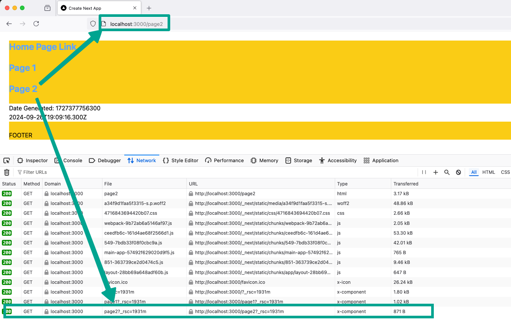

This is a [Next.js](https://nextjs.org/) project bootstrapped with [`create-next-app`](https://github.com/vercel/next.js/tree/canary/packages/create-next-app).

## Next/Link prefetches current page

This repository demonstrates an issue with the `next/link` component where it prefetches the current page that the browser is currently viewing. This is a waste of network + cpu resources.

This bug is reproducable in next@canary and react@beta:

```
  "dependencies": {
    "next": "15.0.0-canary.171",
    "react": "19.0.0-beta-26f2496093-20240514",
    "react-dom": "19.0.0-beta-26f2496093-20240514"
  },
```

## How to reproduce

The application must be run in production mode in order for the `next/link` prefetching to occur.

-  build the application with `pnpm build`
-  run with `pnpm start`
-  See the network tab prefetching the page routes, including the current page being viewied.

See the below responses of each prefetch, taken with Firefox Developer Editon:

